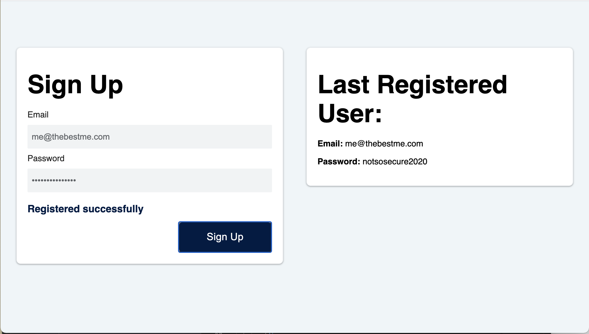

# 🏗️ Implement Client-Side Storage for Sign-Up Form Using localStorage

Work with a partner to implement the following user story:

* As a developer, I want to save the user's email and password to client-side storage and render the last submission to the page.

## Acceptance Criteria

* It's done when Last Registered User displays the last email and password saved using `localStorage`, if it exists.

* It's done when, once the `signUpButton` is clicked, the email and password entered into the text boxes is saved using `localStorage`.

* It's done when the information under Last Registered User is updated to reflect the data stored using `localStorage`.
  
## Assets

The following image demonstrates the web application's appearance and functionality:

---

## 💡 Hints

What methods do we use with `localStorage` to get and set items?

<!-- Local storage stores : five megabytes of data -->

<!-- Local storage can only stor strings. This means if you need to store values like objects or arrays, you first need to get a string representation of the value. You do this using the JSON.stringify() method. -->

<!-- EXAMPLE : const userObj = {
                username = "Maria",
                email: "maria@mail.com"
                }

localStorage.setItem('user', JSON.stringify(userObj)) -->

<!-- Store Data in Local Storage (localStorage.setItem(key, value)) -->
<!-- Get Data in Local Storage (localStorage.getItem(key, value)) -->

<!-- Retrieving data from local storage. EXAMPLE : 

    const storedUserData = localStorage.getItem('user')

    if (storedUserData) {
        const userData = JSON.parse(storedUserData)
    // You can use userData here...
    } else {
    console.log('User data not found in local storage') }-->

<!-- Delete data in local storage :  localStorage.removeItem(key) -->
<!-- Clear all data from local storage :  localStorage.clear() -->
<!-- Retrieve the name of a key : localStorage.key(0) -->

<!-- Reference URL : https://www.freecodecamp.org/news/use-local-storage-in-modern-applications/ -->

## 🏆 Bonus

If you have completed this activity, work through the following challenge with your partner to further your knowledge:

* Does data stored using `localStorage` have an expiration date? What happens when the browser is closed?

No. The data persists in local storage.

Use [Google](https://www.google.com) or another search engine to research this.

---

© 2024 edX Boot Camps LLC. Confidential and Proprietary. All Rights Reserved.
